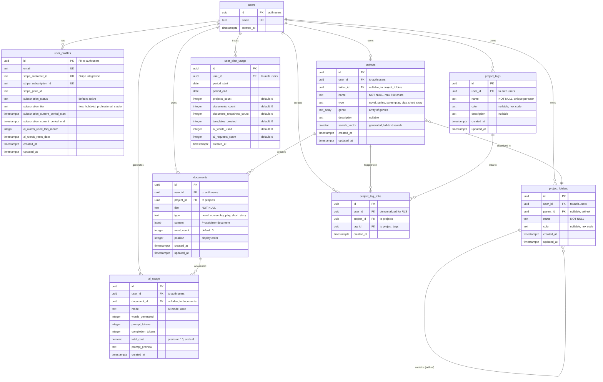

# Database Schema ER Diagram

## Core Entity Relationships

## Cascade Behaviors

### ON DELETE CASCADE
Deleting a parent row automatically deletes child rows:

- `auth.users` → `user_profiles` (1:1 relationship)
- `auth.users` → `projects` (deletes all user's projects)
- `auth.users` → `documents` (deletes all user's documents)
- `auth.users` → `project_folders` (deletes all user's folders)
- `auth.users` → `project_tags` (deletes all user's tags)
- `auth.users` → `project_tag_links` (deletes all user's tag links)
- `auth.users` → `ai_usage` (deletes all user's AI usage records)
- `auth.users` → `user_plan_usage` (deletes all user's usage records)
- `projects` → `documents` (deletes all project documents)
- `projects` → `project_tag_links` (deletes all project tag associations)
- `project_tags` → `project_tag_links` (deletes all tag associations)
- `project_folders` → `project_folders` (deletes child folders recursively)

### ON DELETE SET NULL
Parent deletion keeps child rows but nullifies foreign key:

- `project_folders` → `projects.folder_id` (projects move to root level)
- `documents` → `ai_usage.document_id` (preserves AI usage stats)

## Key Design Patterns

### Multi-Tenant Isolation
All tables include `user_id` with RLS policies enforcing `auth.uid() = user_id`:
- Ensures complete data isolation between users
- Indexed for performance
- Denormalized in junction tables for RLS efficiency

### Hierarchical Folders
`project_folders` uses self-referencing foreign key:
- `parent_id` references `project_folders(id)`
- NULL `parent_id` = root folder
- Supports unlimited nesting depth
- CASCADE delete removes entire subtree

### Many-to-Many with Metadata
`project_tag_links` junction table includes:
- `id` as primary key (stable row identifier)
- `created_at` timestamp (audit trail)
- `user_id` denormalization (RLS performance)
- Unique constraint on `(project_id, tag_id)` prevents duplicates

### Full-Text Search
`projects.search_vector`:
- Generated column (auto-updates)
- Indexes `name` and `description`
- GIN index for fast searches
- Supports ranking and relevance

### Soft Constraints
`subscription_tier` uses CHECK constraint:
- Enforces valid values at database level
- Application can query allowed values
- Prevents invalid data entry

## Index Strategy

### Composite Indexes
- `(user_id, updated_at DESC)` - Paginated user queries
- `(user_id, parent_id)` - Folder hierarchies
- `(user_id, name)` - Sorted lists with filtering

### Specialized Indexes
- GIN on `search_vector` - Full-text search
- GIN on `genre[]` - Array containment queries
- B-tree on foreign keys - JOIN performance
- B-tree on timestamps - Temporal queries

## Related Documentation

- [Schema Overview](./schema-overview.md) - Detailed table descriptions
- [Data Dictionary](./data-dictionary.md) - Enums, constraints, business rules
- [API-Schema Mapping](./api-schema-mapping.md) - API routes to table mapping
- [Migration Guidelines](./migration-guidelines.md) - Schema evolution best practices
