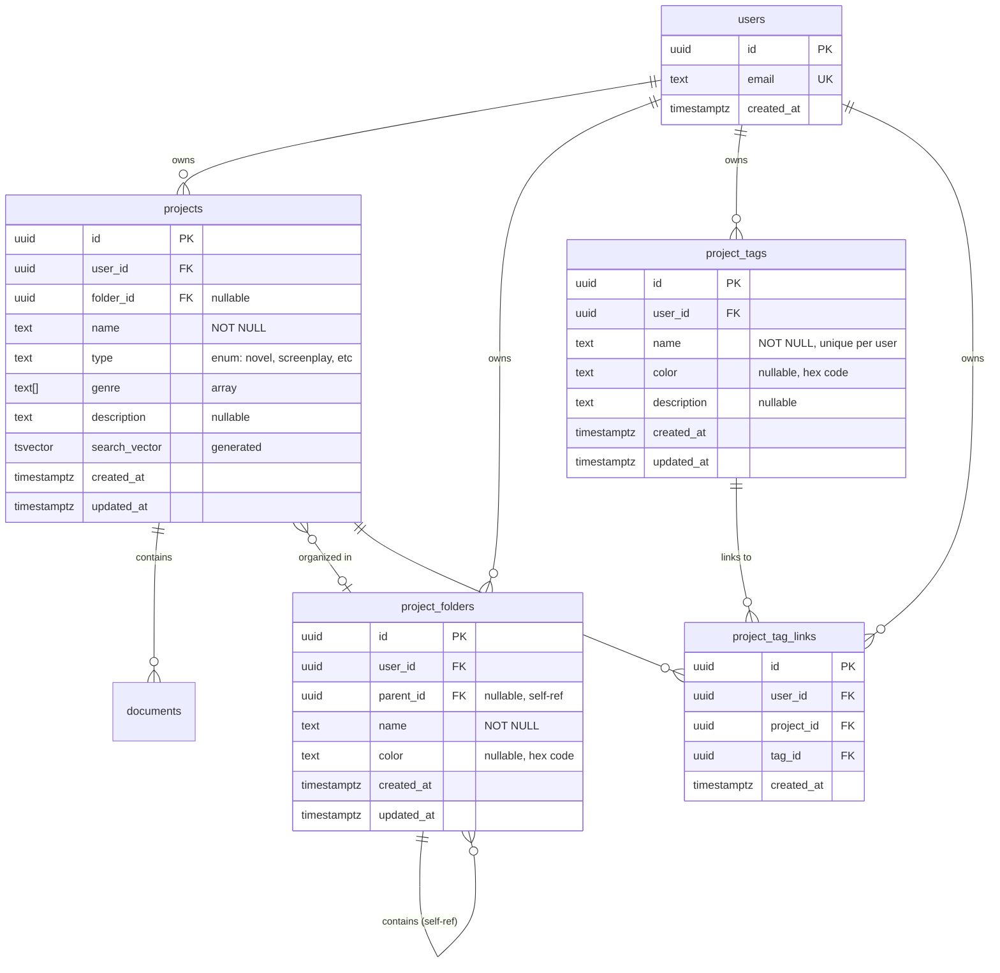

# DB-008: Create Comprehensive Database Schema Documentation

## Severity
ℹ️ **INFO / LOW PRIORITY**

## Priority
**SHORT TERM** - Complete within 2-3 weeks

## Description
Database schema lacks comprehensive documentation, making it difficult for new developers to understand the data model and relationships:

### Missing Documentation

1. **No ER Diagram**
   - Visual representation of table relationships
   - Hard to understand data model at a glance

2. **No Schema Overview Document**
   - No central place to understand all tables
   - No explanation of design decisions
   - No relationship documentation

3. **No Column-Level Documentation**
   - Table comments missing
   - Column comments missing
   - No description of enum values or constraints

4. **No Data Dictionary**
   - No glossary of domain terms
   - No explanation of business rules
   - No documentation of calculated fields

5. **No API-Schema Alignment Doc**
   - Unclear which API routes use which tables
   - No documentation of query patterns
   - No explanation of RLS policies in context

## Impact/Risk Assessment
- **Developer Onboarding**: MEDIUM (slows down new team members)
- **Maintenance**: MEDIUM (harder to modify schema safely)
- **Code Review**: LOW (reviewers need to infer relationships)
- **Bug Prevention**: LOW (unclear constraints lead to bugs)

## Root Cause
- Fast development pace prioritized features over documentation
- No documentation process established
- No tooling for auto-generating schema docs

## Solution

### 1. Create ER Diagram
Use a tool to generate visual schema diagram.

**Tools to consider**:
- `dbdocs.io` (cloud-based, collaborative)
- `dbdiagram.io` (simple online tool)
- `SchemaSpy` (auto-generates HTML docs)
- `DBeaver` (can export ER diagrams)
- `Mermaid` (code-based diagrams in markdown)

**Example using Mermaid**:
Create: `docs/database/schema-er-diagram.md`

```markdown
# Database Schema ER Diagram


```

### 2. Create Schema Overview Document
Create: `docs/database/schema-overview.md`

```markdown
# Database Schema Overview

## Core Entities

### Users (auth.users)
Managed by Supabase Auth. Contains user authentication and profile data.

**Access Pattern**: All queries filter by `user_id` for multi-tenant isolation.

---

### Projects (public.projects)
Main entity representing a writing project (novel, screenplay, etc.).

**Columns**:
- `id` (uuid, PK): Unique project identifier
- `user_id` (uuid, FK → auth.users): Owner of the project
- `folder_id` (uuid, FK → project_folders): Optional folder organization
- `name` (text): Project title (max 500 characters)
- `type` (text): Project type - enum values:
  - `novel` - Long-form fiction
  - `short-story` - Short fiction
  - `screenplay` - Film/TV script
  - `stage-play` - Theater script
  - `other` - Custom project type
- `genre` (text[]): Array of genres (e.g., ['fantasy', 'adventure'])
- `description` (text): Optional project description
- `search_vector` (tsvector): Full-text search index (auto-generated)
- `created_at`, `updated_at` (timestamptz): Timestamps

**Relationships**:
- Owned by one user (many-to-one with users)
- Organized in zero or one folder (many-to-one with project_folders)
- Tagged with many tags (many-to-many via project_tag_links)
- Contains many documents (one-to-many with documents)

**RLS Policy**:
- Users can only access their own projects (auth.uid() = user_id)

**Indexes**:
- `projects_user_idx` (user_id, updated_at DESC): List user's projects
- `idx_projects_folder_id` (folder_id): Filter by folder
- `idx_projects_type` (type): Filter by type
- `idx_projects_search_vector_gin` (search_vector): Full-text search

**Common Queries**:
```sql
-- List user's projects
SELECT * FROM projects
WHERE user_id = auth.uid()
ORDER BY updated_at DESC;

-- Filter by folder
SELECT * FROM projects
WHERE user_id = auth.uid()
  AND folder_id = $1;

-- Search projects
SELECT * FROM projects
WHERE user_id = auth.uid()
  AND search_vector @@ to_tsquery($1);
```

---

### Project Folders (public.project_folders)
Organizational hierarchy for grouping projects.

**Features**:
- Nested folders (self-referencing via `parent_id`)
- Color coding for visual organization
- User-scoped (isolated per user)

**Columns**:
- `id` (uuid, PK): Unique folder identifier
- `user_id` (uuid, FK → auth.users): Owner
- `parent_id` (uuid, FK → project_folders): Parent folder (nullable for root folders)
- `name` (text): Folder name
- `color` (text): Optional hex color code (e.g., '#FF5733')
- `created_at`, `updated_at` (timestamptz): Timestamps

**Relationships**:
- Owned by one user
- Contains many projects (one-to-many with projects)
- Contains many child folders (one-to-many with self)
- Belongs to one parent folder (many-to-one with self, nullable)

**RLS Policy**:
- Users can only access their own folders

**Cascade Behavior**:
- Deleting a folder: Sets projects.folder_id to NULL (ON DELETE SET NULL)
- Deleting a folder: Deletes child folders recursively (ON DELETE CASCADE)

**Common Queries**:
```sql
-- Get all root folders
SELECT * FROM project_folders
WHERE user_id = auth.uid()
  AND parent_id IS NULL
ORDER BY name;

-- Get folder hierarchy (recursive)
WITH RECURSIVE folder_tree AS (
  SELECT id, name, parent_id, 0 AS level
  FROM project_folders
  WHERE user_id = auth.uid() AND parent_id IS NULL

  UNION ALL

  SELECT f.id, f.name, f.parent_id, t.level + 1
  FROM project_folders f
  JOIN folder_tree t ON f.parent_id = t.id
)
SELECT * FROM folder_tree ORDER BY level, name;
```

---

### Project Tags (public.project_tags)
Flexible labeling system for categorizing projects.

**Columns**:
- `id` (uuid, PK): Unique tag identifier
- `user_id` (uuid, FK → auth.users): Owner
- `name` (text): Tag name (unique per user, case-insensitive)
- `color` (text): Optional hex color code
- `description` (text): Optional tag description
- `created_at`, `updated_at` (timestamptz): Timestamps

**Constraints**:
- UNIQUE (user_id, LOWER(name)): Case-insensitive uniqueness per user

**Relationships**:
- Owned by one user
- Links to many projects (many-to-many via project_tag_links)

**RLS Policy**:
- Users can only access their own tags

**Common Queries**:
```sql
-- Get all user's tags
SELECT * FROM project_tags
WHERE user_id = auth.uid()
ORDER BY name;

-- Get projects with specific tag
SELECT p.*
FROM projects p
JOIN project_tag_links ptl ON p.id = ptl.project_id
WHERE ptl.tag_id = $1
  AND p.user_id = auth.uid();
```

---

### Project Tag Links (public.project_tag_links)
Junction table for many-to-many relationship between projects and tags.

**Columns**:
- `id` (uuid, PK): Unique link identifier
- `user_id` (uuid, FK → auth.users): Owner (denormalized for RLS)
- `project_id` (uuid, FK → projects): Project being tagged
- `tag_id` (uuid, FK → project_tags): Tag being applied
- `created_at` (timestamptz): When tag was applied

**Constraints**:
- UNIQUE (project_id, tag_id): One tag per project (no duplicates)

**Why denormalized user_id?**
Improves RLS performance by avoiding joins on every query.

**Cascade Behavior**:
- Deleting a project: Deletes all tag links (ON DELETE CASCADE)
- Deleting a tag: Deletes all tag links (ON DELETE CASCADE)

**Common Queries**:
```sql
-- Get all tags for a project
SELECT t.*
FROM project_tags t
JOIN project_tag_links ptl ON t.id = ptl.tag_id
WHERE ptl.project_id = $1
  AND t.user_id = auth.uid();

-- Add tag to project
INSERT INTO project_tag_links (user_id, project_id, tag_id)
VALUES (auth.uid(), $1, $2);
```

## Design Decisions

### Why tsvector for search?
PostgreSQL's full-text search is faster and more flexible than LIKE queries:
- Handles stemming (e.g., "running" matches "run")
- Supports ranking and relevance
- Auto-updates via generated column

### Why denormalize user_id in project_tag_links?
RLS policies need to check user_id on every query. Without denormalization:
```sql
-- Slow: Requires join to check user_id
SELECT * FROM project_tag_links ptl
JOIN projects p ON ptl.project_id = p.id
WHERE p.user_id = auth.uid();

-- Fast: Direct user_id check
SELECT * FROM project_tag_links
WHERE user_id = auth.uid();
```

### Why nullable folder_id in projects?
Not all projects need to be organized in folders. NULL means "not in any folder" (root level).

### Why SET NULL instead of CASCADE for folder deletion?
Deleting a folder shouldn't delete all projects inside. Instead:
- Folder deleted → Projects moved to root level (folder_id = NULL)
- User can then reorganize projects into different folders

## Row-Level Security (RLS)

All tables enforce user isolation:
```sql
-- All policies follow this pattern
CREATE POLICY "Users can manage their {table}"
ON public.{table}
FOR ALL
TO authenticated
USING (auth.uid() = user_id);
```

**Why FOR ALL?**
Same check applies to SELECT, INSERT, UPDATE, DELETE - cleaner than 4 separate policies.

## Performance Considerations

### Index Strategy
- Composite indexes for common query patterns
  - Example: `(user_id, updated_at DESC)` for paginated lists
  - Example: `(user_id, folder_id, type)` for filtered lists
- GIN indexes for full-text search and array columns
- Foreign key indexes for CASCADE deletes

### Query Optimization
- Always filter by user_id first (uses indexed RLS)
- Use prepared statements for repeated queries
- Avoid SELECT * in production (specify columns)
```

### 3. Add Table and Column Comments
Create: `supabase/migrations/YYYYMMDDHHMMSS_add_schema_comments.sql`

```sql
-- ============================================================================
-- Add schema documentation via PostgreSQL comments
-- ============================================================================

-- Projects table
COMMENT ON TABLE public.projects IS 'Writing projects (novels, screenplays, etc.) owned by users';
COMMENT ON COLUMN public.projects.id IS 'Unique project identifier';
COMMENT ON COLUMN public.projects.user_id IS 'Owner of the project (FK to auth.users)';
COMMENT ON COLUMN public.projects.folder_id IS 'Optional folder for organization (FK to project_folders)';
COMMENT ON COLUMN public.projects.name IS 'Project title (max 500 characters)';
COMMENT ON COLUMN public.projects.type IS 'Project type: novel, short-story, screenplay, stage-play, other';
COMMENT ON COLUMN public.projects.genre IS 'Array of genre tags (e.g., [''fantasy'', ''adventure''])';
COMMENT ON COLUMN public.projects.description IS 'Optional project description';
COMMENT ON COLUMN public.projects.search_vector IS 'Full-text search index (auto-generated from name and description)';
COMMENT ON COLUMN public.projects.created_at IS 'When the project was created';
COMMENT ON COLUMN public.projects.updated_at IS 'When the project was last modified';

-- Project folders table
COMMENT ON TABLE public.project_folders IS 'Hierarchical folders for organizing projects';
COMMENT ON COLUMN public.project_folders.id IS 'Unique folder identifier';
COMMENT ON COLUMN public.project_folders.user_id IS 'Owner of the folder (FK to auth.users)';
COMMENT ON COLUMN public.project_folders.parent_id IS 'Parent folder for nesting (FK to self, NULL for root folders)';
COMMENT ON COLUMN public.project_folders.name IS 'Folder name';
COMMENT ON COLUMN public.project_folders.color IS 'Optional hex color code for UI (e.g., #FF5733)';
COMMENT ON COLUMN public.project_folders.created_at IS 'When the folder was created';
COMMENT ON COLUMN public.project_folders.updated_at IS 'When the folder was last modified';

-- Project tags table
COMMENT ON TABLE public.project_tags IS 'User-defined tags for categorizing projects';
COMMENT ON COLUMN public.project_tags.id IS 'Unique tag identifier';
COMMENT ON COLUMN public.project_tags.user_id IS 'Owner of the tag (FK to auth.users)';
COMMENT ON COLUMN public.project_tags.name IS 'Tag name (unique per user, case-insensitive)';
COMMENT ON COLUMN public.project_tags.color IS 'Optional hex color code for UI';
COMMENT ON COLUMN public.project_tags.description IS 'Optional tag description';
COMMENT ON COLUMN public.project_tags.created_at IS 'When the tag was created';
COMMENT ON COLUMN public.project_tags.updated_at IS 'When the tag was last modified';

-- Project tag links table
COMMENT ON TABLE public.project_tag_links IS 'Junction table linking projects to tags (many-to-many)';
COMMENT ON COLUMN public.project_tag_links.id IS 'Unique link identifier';
COMMENT ON COLUMN public.project_tag_links.user_id IS 'Denormalized user_id for RLS performance (FK to auth.users)';
COMMENT ON COLUMN public.project_tag_links.project_id IS 'Project being tagged (FK to projects)';
COMMENT ON COLUMN public.project_tag_links.tag_id IS 'Tag being applied (FK to project_tags)';
COMMENT ON COLUMN public.project_tag_links.created_at IS 'When the tag was applied to the project';
```

### 4. Create Data Dictionary
Create: `docs/database/data-dictionary.md`

```markdown
# Database Data Dictionary

## Enums and Constants

### Project Types
| Value | Description | Example |
|-------|-------------|---------|
| `novel` | Long-form fiction (50,000+ words) | Full-length novel |
| `short-story` | Short fiction (< 50,000 words) | Novelette, novella |
| `screenplay` | Film or TV script | Movie screenplay |
| `stage-play` | Theater script | Broadway play |
| `other` | Custom project type | Poetry collection, essays |

### Project Genres
Common values (user-defined, not enforced):
- `fantasy`, `sci-fi`, `mystery`, `thriller`, `romance`, `horror`
- `literary-fiction`, `historical`, `adventure`, `comedy`, `drama`

### Color Codes
Format: Hex color code (e.g., `#FF5733`)
- Used for folders and tags in UI
- Optional (NULL allowed)

## Business Rules

### Folder Hierarchy
- **Max depth**: Unlimited (but UI may limit to 10 levels)
- **Root folders**: Have `parent_id = NULL`
- **Deletion**: Child folders are deleted recursively (CASCADE)
- **Projects**: Moved to root when folder deleted (SET NULL)

### Tag Uniqueness
- **Case-insensitive**: "Fantasy" and "fantasy" are the same tag
- **Per-user**: User A and User B can both have "fantasy" tag
- **Constraint**: `UNIQUE (user_id, LOWER(name))`

### User Isolation
- **RLS enforced**: All queries filter by `auth.uid() = user_id`
- **No cross-user access**: Users cannot see/modify others' data
- **Performance**: user_id indexed on all tables

## Calculated Fields

### projects.search_vector
- **Type**: tsvector (PostgreSQL full-text search)
- **Generated from**: `name || ' ' || COALESCE(description, '')`
- **Language**: English (default)
- **Auto-updates**: Yes (generated column)

## Constraints Summary

| Table | Constraint | Type | Rule |
|-------|------------|------|------|
| projects | projects_pkey | PRIMARY KEY | id |
| projects | projects_user_id_fkey | FOREIGN KEY | user_id → auth.users |
| projects | projects_folder_id_fkey | FOREIGN KEY | folder_id → project_folders (SET NULL) |
| project_folders | project_folders_pkey | PRIMARY KEY | id |
| project_folders | project_folders_user_id_fkey | FOREIGN KEY | user_id → auth.users |
| project_folders | project_folders_parent_id_fkey | FOREIGN KEY | parent_id → project_folders (CASCADE) |
| project_tags | project_tags_pkey | PRIMARY KEY | id |
| project_tags | project_tags_user_id_fkey | FOREIGN KEY | user_id → auth.users |
| project_tags | project_tags_user_name_key | UNIQUE | (user_id, LOWER(name)) |
| project_tag_links | project_tag_links_pkey | PRIMARY KEY | id |
| project_tag_links | project_tag_links_user_id_fkey | FOREIGN KEY | user_id → auth.users |
| project_tag_links | project_tag_links_project_id_fkey | FOREIGN KEY | project_id → projects (CASCADE) |
| project_tag_links | project_tag_links_tag_id_fkey | FOREIGN KEY | tag_id → project_tags (CASCADE) |
| project_tag_links | project_tag_links_project_tag_unique | UNIQUE | (project_id, tag_id) |
```

### 5. Document API-Schema Mapping
Create: `docs/database/api-schema-mapping.md`

```markdown
# API Routes → Database Schema Mapping

## Projects API

### GET /api/projects/query
**Tables Used**:
- projects (main query)
- project_folders (for folder names)
- project_tags (for tag names)
- project_tag_links (for tag filtering)

**Query Pattern**:
```sql
-- Step 1: Filter projects
SELECT * FROM projects
WHERE user_id = $user_id
  AND type = $type (optional)
  AND folder_id = $folder_id (optional)
  AND search_vector @@ to_tsquery($search) (optional)

-- Step 2: Join tags
SELECT t.* FROM project_tags t
JOIN project_tag_links ptl ON t.id = ptl.tag_id
WHERE ptl.project_id = ANY($project_ids)

-- Step 3: Join folders
SELECT * FROM project_folders
WHERE id = ANY($folder_ids)
```

**Indexes Used**:
- projects_user_idx (user_id, updated_at DESC)
- idx_projects_folder_id
- idx_projects_type
- idx_project_tag_links_tag_id

### POST /api/projects
**Tables Used**:
- projects (INSERT)

**Query Pattern**:
```sql
INSERT INTO projects (user_id, name, type, genre, description, folder_id)
VALUES ($1, $2, $3, $4, $5, $6)
RETURNING *;
```

### PATCH /api/projects/[id]
**Tables Used**:
- projects (UPDATE)

**RLS Check**: Automatically enforces `user_id = auth.uid()`

---

## Folders API

### GET /api/folders
**Tables Used**:
- project_folders

**Query Pattern**:
```sql
SELECT * FROM project_folders
WHERE user_id = auth.uid()
ORDER BY created_at ASC;
```

### GET /api/folders/[id]/projects
**Tables Used**:
- projects
- project_folders (for validation)

**Query Pattern**:
```sql
SELECT * FROM projects
WHERE user_id = auth.uid()
  AND folder_id = $1
ORDER BY updated_at DESC;
```

---

## Tags API

### GET /api/tags
**Tables Used**:
- project_tags

**Query Pattern**:
```sql
SELECT * FROM project_tags
WHERE user_id = auth.uid()
ORDER BY name ASC;
```

### POST /api/projects/[id]/tags
**Tables Used**:
- project_tag_links (INSERT)
- projects (validation)
- project_tags (validation)

**Query Pattern**:
```sql
INSERT INTO project_tag_links (user_id, project_id, tag_id)
VALUES (auth.uid(), $1, $2)
ON CONFLICT (project_id, tag_id) DO NOTHING;
```
```

## Testing Requirements

### 1. Verify Documentation Completeness
- [ ] All tables documented
- [ ] All columns documented
- [ ] All relationships explained
- [ ] ER diagram accurate
- [ ] Example queries work
- [ ] All API routes mapped

### 2. Review Documentation Accuracy
```bash
# Compare docs to actual schema
psql -c "\d+ projects"
psql -c "\d+ project_folders"
psql -c "\d+ project_tags"
psql -c "\d+ project_tag_links"

# Verify comments exist
psql -c "SELECT obj_description('public.projects'::regclass);"
```

### 3. Test Example Queries
Run all example queries from documentation to ensure they work correctly.

## Acceptance Criteria
- [x] ER diagram created and reviewed
- [x] Schema overview document created
- [x] Data dictionary completed
- [x] API-schema mapping documented
- [x] Table/column comments added to database
- [x] All example queries tested
- [x] Documentation reviewed by team
- [x] README updated with link to schema docs

## Implementation Summary

**Status**: ✅ COMPLETE

**Files Created**:
1. `docs/database/schema-er-diagram.md` (207 lines) - Mermaid ER diagram with relationships and cascade behaviors
2. `docs/database/schema-overview.md` (934 lines) - Comprehensive documentation of all core tables
3. `docs/database/data-dictionary.md` (580+ lines) - Enums, constraints, business rules, and data types
4. `docs/database/api-schema-mapping.md` (600+ lines) - API route to database table mapping
5. `supabase/migrations/20251025083540_add_schema_comments.sql` (450+ lines) - PostgreSQL comments migration

**Files Updated**:
- `README.md` - Added Database Schema section with links to all documentation

**Total Documentation**: ~2,700+ lines of comprehensive schema documentation

**Key Features**:
- Visual ER diagram with Mermaid syntax
- Detailed table/column descriptions with examples
- Business rules and constraints explained
- Query patterns and performance notes
- RLS policies documented
- API integration patterns
- PostgreSQL COMMENT statements for in-database documentation

**Completed**: 2025-10-25

## Tooling Recommendations

### Auto-generate Documentation
Consider using:
- **SchemaSpy**: Generates HTML docs with ER diagrams
- **tbls**: Generates markdown docs from schema
- **pg_autodoc**: PostgreSQL-specific doc generator

Example with `tbls`:
```bash
# Install
brew install k1LoW/tap/tbls

# Generate docs
tbls doc postgres://... docs/database/schema
```

## Maintenance Plan
- [ ] Update docs when schema changes
- [ ] Add docs check to PR template
- [ ] Review docs quarterly for accuracy
- [ ] Generate fresh ER diagram after major changes

## Related Issues
- Related to DB-006 (Migration Structure)
- Improves onboarding process
- Reduces support questions about schema

## Estimated Effort
**8-12 hours** spread across:
- ER diagram: 2 hours
- Schema overview: 3 hours
- Data dictionary: 2 hours
- API mapping: 2 hours
- Table comments migration: 1 hour
- Review and polish: 2 hours

## Assignee
Backend Team + Technical Writer (if available)

## Labels
`database`, `documentation`, `schema`, `onboarding`, `info`, `dx`
